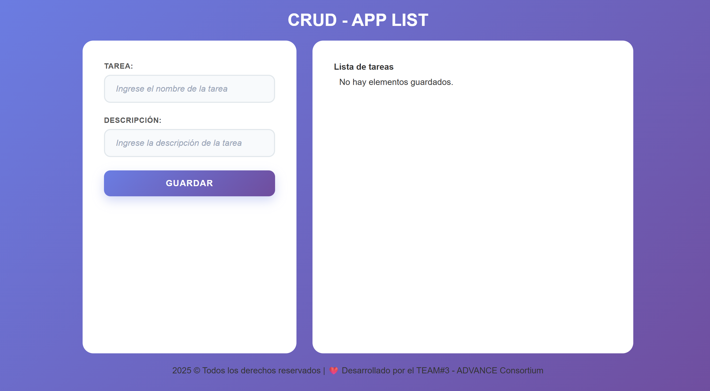
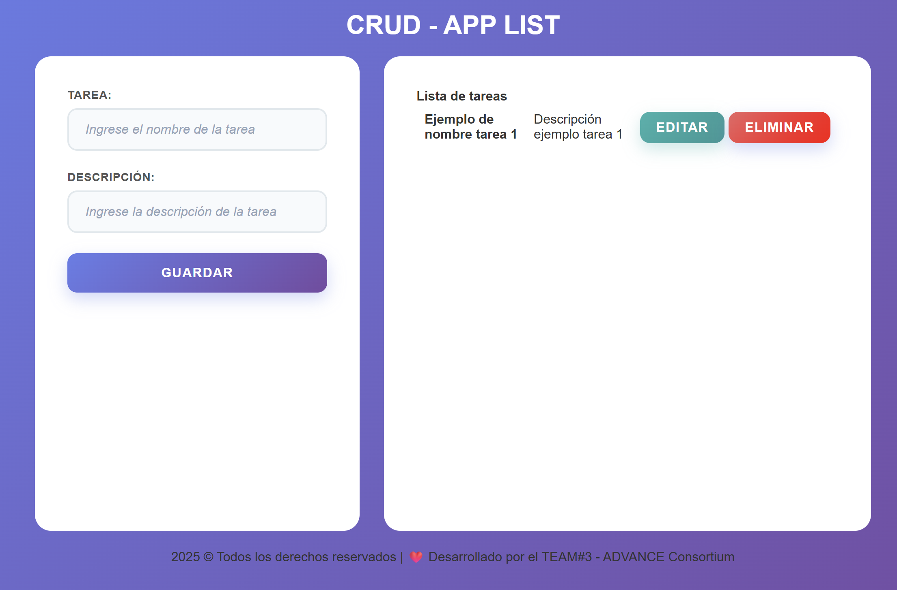

# crudAppCAdvance
Repositorio para trabajo grupal de una Crud App 

# 📝 CRUD en LocalStorage
Autores - Lina M Velásquez , Francisco Tulcan , Juan Pablo Barahona 🧠🚀✨

Este es un proyecto simple de CRUD (Crear, Leer, Actualizar, Eliminar) construido con **HTML**, **CSS** y **JavaScript**, que almacena los datos en el **LocalStorage** del navegador. Cuenta con una interfaz moderna 

---

## 🚀 Demo

http://127.0.0.1:3000/index.html

---

## 🖼️ Captura del proyecto

### Vista principal de la CrudApp


### Vista ejemplifica al agregar y listar tareas


---

## ✨ Funcionalidades

- ✅ Agregar elementos con nombre y descripción.
- ✅ Eliminar elementos individuales.
- ✅ Editar elementos existentes.
- ✅ Guardado automático en el navegador (LocalStorage).
- ✅ Interfaz limpia y moderna con `flexbox`, `grid` y `gradientes`.

---

## 🛠️ Tecnologías utilizadas

- HTML5
- CSS3 (con diseño responsive y gradientes)
- JavaScript (ES6)
- LocalStorage

---

## 📂 Estructura del proyecto
```
crudAppCAdvance/
│
├── index.html
├── style.css
├── app.js
└── README.md
```

---
## ⚙️ Instalación y uso

1. **Clona el repositorio:**
   ```bash
   git clone https://github.com/tuusuario/crudAppCAdvance.git
   ```
2. **Abre la carpeta en tu editor de código.**
3. **Abre `index.html` en tu navegador.**

---

## 🤝 Contribución

¡Las contribuciones son bienvenidas! Por favor, abre un issue o haz un pull request.

---
## Autores

Equipo #3
- [Lina Marcela Velásquez Garzón](https://github.com/LinaMVG)
- [Francisco Javier Tulcán Rodríguez ](https://github.com/FranciscoTulkn)
- [Juan Pablo Barahona](https://github.com/juan112812)
